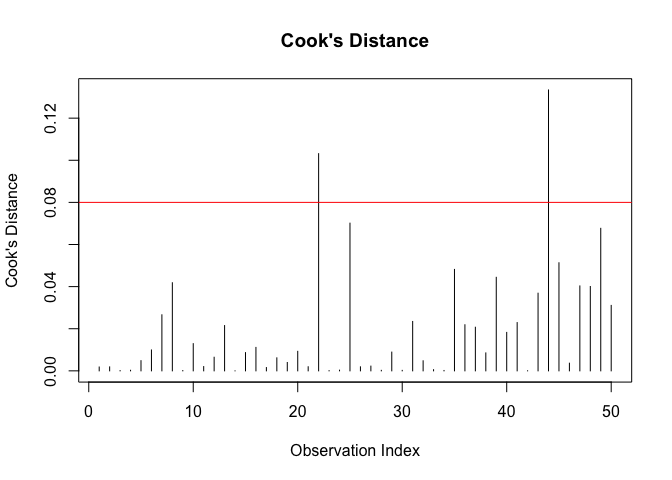
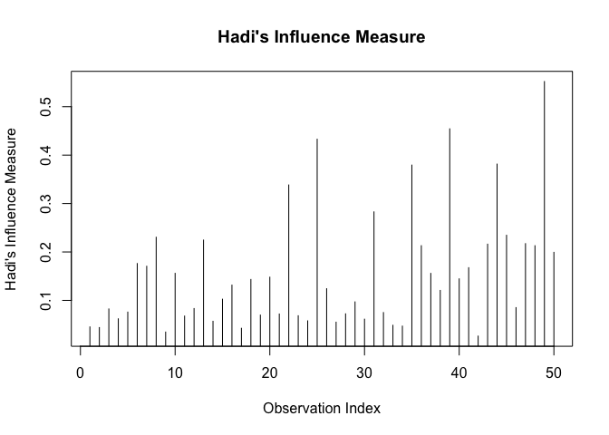

<!-- README.md is generated from README.Rmd. Please edit that file -->

# InfluenceMetric

<!-- badges: start -->
<!-- badges: end -->

## Overview

`InfluenceMetric` is an R package designed to assess the influence of
individual observations in a linear regression model. The package
provides tools to calculate three popular influence measures:

- **Cook’s Distance**: Measures the influence of each data point on the
  regression coefficients.
- **DFFITS**: Assesses the impact of each observation on the fitted
  values.
- **Hadi’s Influence Measure**: Evaluates the influence of observations
  based on both the response and predictor variables.

The package offers a single, user-friendly function,
`influence_diagnostics_plot`, that allows users to calculate and
visualise these influence measures with ease.

## Installation

You can install the development version of InfluenceMetric from
[GitHub](https://github.com/) with:

``` r
# install.packages("devtools")
devtools::install_github("alexkzw/InfluenceMetric")
```

## Example

Here is a basic example of how to use InfluenceMetric to calculate and
visualise Cook’s Distance

``` r
library(InfluenceMetric)

# Set seed for reproducibility
set.seed(123)

# Generate random data
n <- 50  # number of observations
p <- 2   # number of predictors (excluding intercept)

X <- matrix(rnorm(n * p), n, p)
y <- rnorm(n)

# Add intercept term to the design matrix
X <- cbind(1, X)

# Fit linear model
model <- lm(y ~ X - 1)

# Plot Cook's Distance
influence_diagnostics_plot(model, measure = "cooks_distance", return_type = "plot", X, y)
```



You can also return the DFFITS values as a numeric vector:

``` r
# Return DFFITS values
dffits_values <- influence_diagnostics_plot(model, measure = "dffits", return_type = "measure", X, y)

# Print the first few DFFITS values
head(dffits_values)
#>             [,1]
#> [1,] -0.07391089
#> [2,]  0.07505821
#> [3,] -0.01888071
#> [4,]  0.02871133
#> [5,] -0.12039860
#> [6,]  0.17249046
```

You can also calculate and plot Hadi’s Influence Measure:

``` r
# Plot Hadi's Influence Measure
influence_diagnostics_plot(model, measure = "hadis_influence", return_type = "plot", X, y)
```


